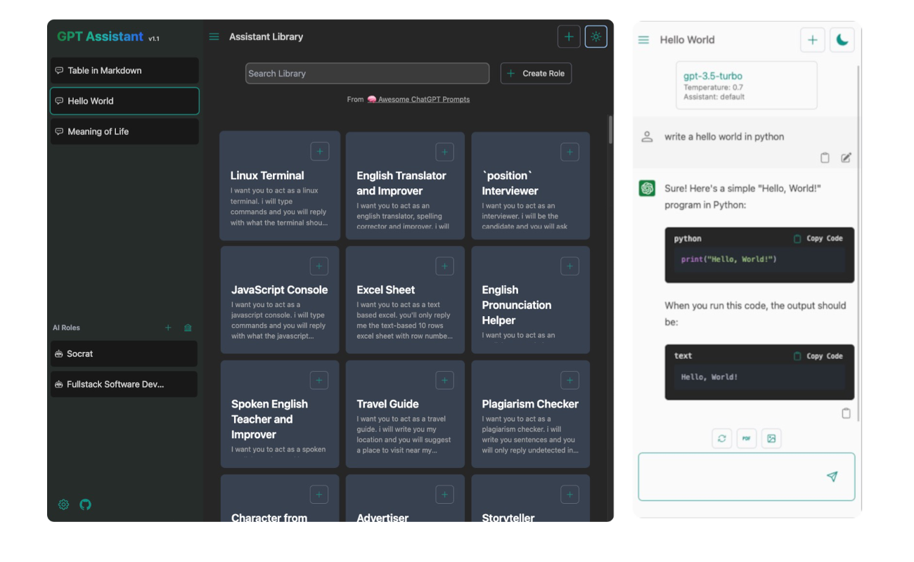

 
<h1>👨‍🎨 GPT Assistant</h1>

[Demo Site](https://ai-assist-teal.vercel.app/role)

 

### Web app designed to enhance your interaction with OpenAI's language models.

## Features

-   **Customizable AI Assistant**: Create your own assistant role, or choose one from 'Awesome Prompts' library
-   **Responsive Design**: Responsive, minimalist design with a dark mode
-   **Rapid Responses**: Fast streamming response
-   **Fine-Tuned Interactions**: Adjust conversation parameters, such as prompt instructions, temperature, and maximum tokens, at both app and chat level
-   **Security** data are safely stored locally
-   **Sharing** Save chats in PDF or image formats
