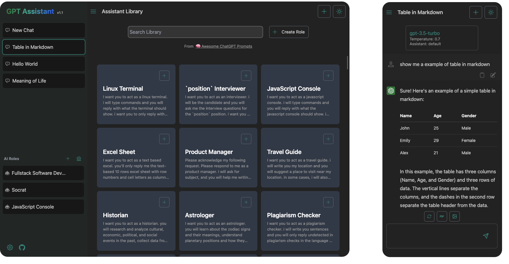
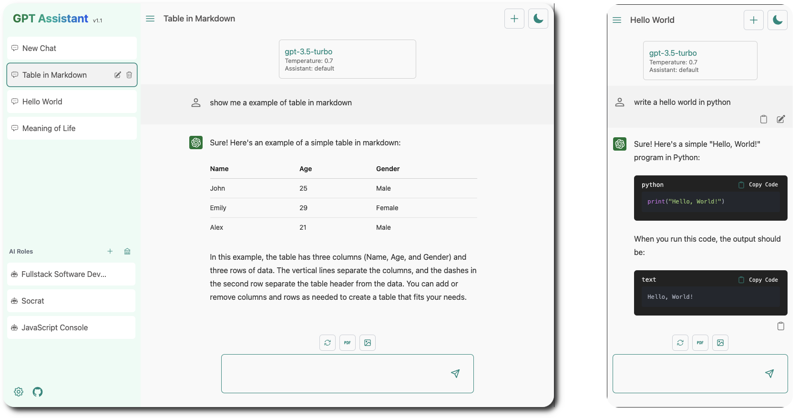

 
<h1>👨‍🎨 GPT Assistant</h1>

### Web app designed to enhance your interaction with OpenAI's language models.

 
<a style='font-size: 1.5rem;' href='https://ai-assist-teal.vercel.app/role'>Visit Demo Site</a>

 

 

## Features

-   Create your own assistant role, or use one from the library which has been ported from 'Awesome Prompts'
-   Responsive design with a dark mode
-   Streamming response
-   Adjust conversation parameters at both app and chat level
-   Data are stored locally in your broswer
-   Save chats in PDF or image formats
-   One click deployment to Vercel
